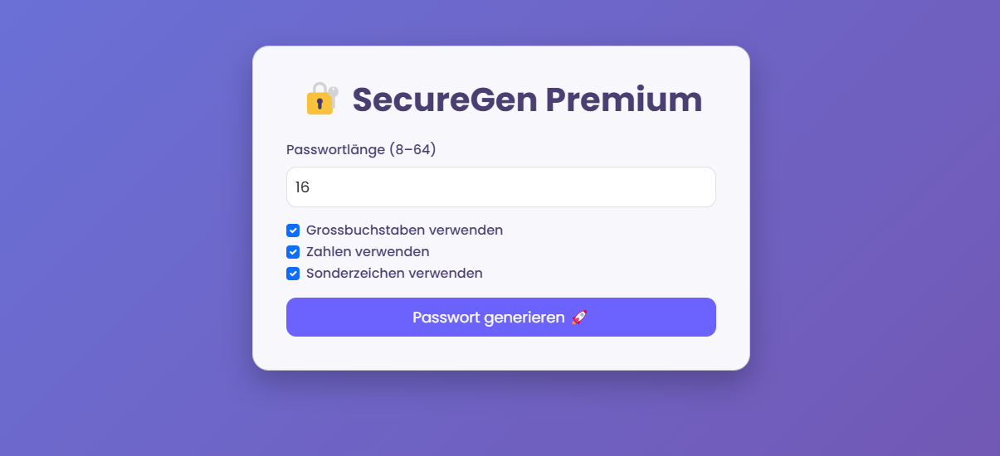

# Lernjournal 1 Python

## Repository und Library

| | Bitte ausfüllen |
| -------- | ------- |
| Repository (URL)  | https://github.com/Drit0n/MDM-Lernjournal
| Kurze Beschreibung der App-Funktion | Eine Flask-Webanwendung, die sichere Passwörter generiert. Nutzer können Passwortlänge und -komplexität individuell auswählen. |
| Verwendete Library aus PyPi (Name) |Flask (PyPi Flask) |
| Verwendete Library aus PyPi (URL) |https://docs.python.org/3/library/secrets.html|
| ... | |
| ... | |

## App, Funktionalität

Die Web-App bietet eine benutzerfreundliche Oberfläche, auf der Nutzer die gewünschte Passwortlänge und verschiedene Komplexitätsoptionen (Klein-/Grossbuchstaben, Zahlen und Sonderzeichen) auswählen können. Die Anwendung generiert anschließend ein kryptografisch sicheres Passwort mithilfe der integrierten Python-Bibliothek secrets. Zusätzlich kann das generierte Passwort per Klick kopiert werden.




[Video-Demo der App ansehen](videos/SecureGen_demo.mp4)

**Backend (`app.py`)**

Im Backend, umgesetzt mit Flask, wird die Bibliothek secrets aus Python verwendet, um Passwörter auf sichere, kryptografische Weise zu generieren.Diese Einstellungen werden an das Backend gesendet, welches daraufhin das Passwort generiert und an das Frontend zurückgibt.

```python
from flask import Flask, render_template, request
import secrets
import string

app = Flask(__name__)

@app.route('/', methods=['GET', 'POST'])
def index():
    password = ''
    if request.method == 'POST':
        length = int(request.form['length'])
        use_upper = 'uppercase' in request.form
        use_digits = 'digits' in request.form
        use_special = 'special' in request.form

        chars = string.ascii_lowercase
        if use_upper:
            chars += string.ascii_uppercase
        if use_digits:
            chars += string.digits
        if use_special:
            chars += string.punctuation

        password = ''.join(secrets.choice(chars) for _ in range(length))

    return render_template('index.html', password=password)

if __name__ == '__main__':
    app.run(debug=True)
```


**Frontend (index.html)**
```python
<!DOCTYPE html>
<html lang="de">

<head>
    <meta charset="UTF-8">
    <title>🔒 SecureGen Premium | Passwortgenerator</title>
    <link href="https://cdn.jsdelivr.net/npm/bootstrap@5.3.0/dist/css/bootstrap.min.css" rel="stylesheet">
    <link rel="preconnect" href="https://fonts.googleapis.com">
    <link rel="preconnect" href="https://fonts.gstatic.com" crossorigin>
    <link href="https://fonts.googleapis.com/css2?family=Poppins:wght@400;500;600;700&display=swap" rel="stylesheet">
    <style>
        body {
            font-family: 'Poppins', sans-serif;
            background: linear-gradient(135deg, #667eea, #764ba2);
            color: #fff;
            display: flex;
            justify-content: center;
            align-items: center;
            min-height: 100vh;
            margin: 0;
            padding: 20px;
        }

        .card {
            background: rgba(255, 255, 255, 0.95);
            backdrop-filter: blur(10px);
            border-radius: 20px;
            padding: 40px;
            width: 100%;
            max-width: 600px;
            box-shadow: 0 15px 35px rgba(0,0,0,0.25);
            animation: fadeIn 1s ease;
        }

        @keyframes fadeIn {
            from { opacity: 0; transform: translateY(-30px); }
            to { opacity: 1; transform: translateY(0); }
        }

        h1 {
            text-align: center;
            color: #4b3f72;
            font-weight: 700;
            margin-bottom: 25px;
        }

        .form-control, .btn-primary {
            border-radius: 12px;
            padding: 10px;
            font-size: 18px;
        }

        .form-check-label, .form-label {
            color: #4b3f72;
            font-weight: 500;
        }

        .btn-primary {
            background-color: #6c63ff;
            border: none;
            transition: background-color 0.3s ease;
            width: 100%;
            margin-top: 15px;
        }

        .btn-primary:hover {
            background-color: #564fdc;
        }

        .alert-success {
            background-color: #dff4ea;
            color: #1f7654;
            border-radius: 12px;
            display: flex;
            justify-content: space-between;
            align-items: center;
            font-weight: 600;
            margin-top: 25px;
        }

        .copy-btn {
            background: none;
            border: none;
            color: #4b3f72;
            font-size: 22px;
            cursor: pointer;
            transition: transform 0.2s ease;
        }

        .copy-btn:hover {
            transform: scale(1.2);
        }
    </style>
</head>

<body>
    <div class="card">
        <h1>🔐 SecureGen Premium</h1>
        <form method="post">
            <label class="form-label">Passwortlänge (8–64)</label>
            <input type="number" name="length" class="form-control" min="8" max="64" value="16">

            <div class="form-check mt-3">
                <input type="checkbox" name="uppercase" id="uppercase" class="form-check-input" checked>
                <label for="uppercase" class="form-check-label">Grossbuchstaben verwenden</label>
            </div>
            <div class="form-check">
                <input type="checkbox" name="digits" id="digits" class="form-check-input" checked>
                <label for="digits" class="form-check-label">Zahlen verwenden</label>
            </div>
            <div class="form-check">
                <input type="checkbox" name="special" id="special" class="form-check-input" checked>
                <label for="special" class="form-check-label">Sonderzeichen verwenden</label>
            </div>

            <button type="submit" class="btn btn-primary">Passwort generieren 🚀</button>
        </form>

        
        <div class="alert alert-success">
            <span id="generated-password">{{ password }}</span>
            <button onclick="copyToClipboard()" class="copy-btn">📋</button>
        </div>
        
    </div>

    <script src="{{ url_for('static', filename='script.js') }}"></script>
</body>

</html>
```


**JavaScript (Script.js)**

Die generierte Ausgabe wird anschließend übersichtlich angezeigt und bietet eine einfache Kopierfunktion. Ein Klick auf das generierte Passwort genügt, um dieses sicher und komfortabel in die Zwischenablage zu kopieren, was die Benutzerfreundlichkeit zusätzlich erhöht.

```python
function copyToClipboard() {
    const password = document.getElementById("generated-password").innerText;
    navigator.clipboard.writeText(password).then(() => {
        alert("✅ Passwort erfolgreich kopiert!");
    }, (err) => {
        alert("❌ Kopieren fehlgeschlagen!");
    });
}
```

## Dependency Management


## Deployment

* [ ] TODO

