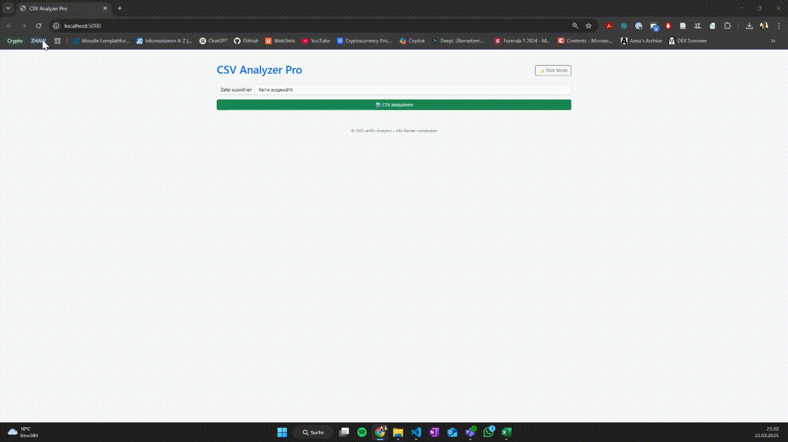
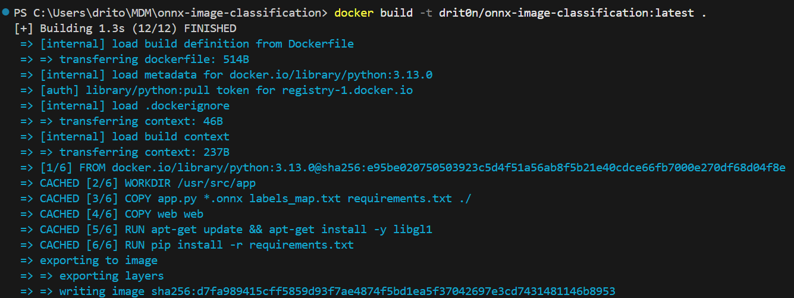
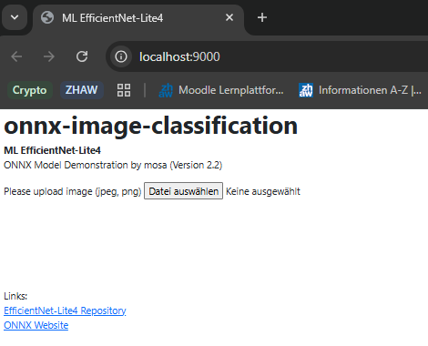
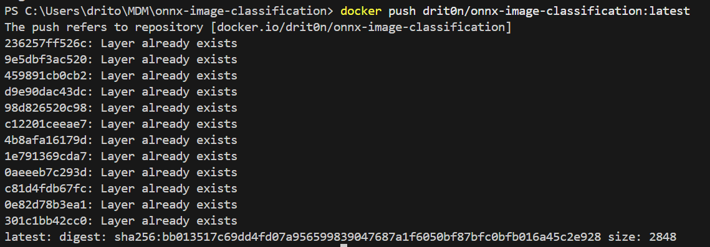
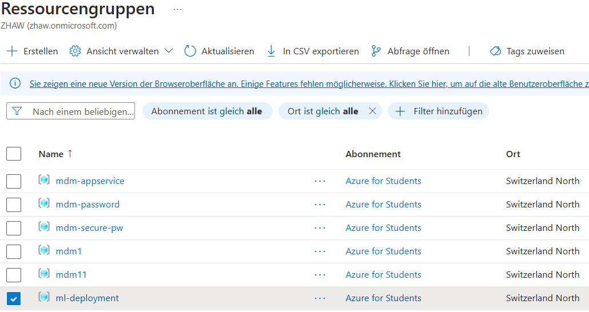
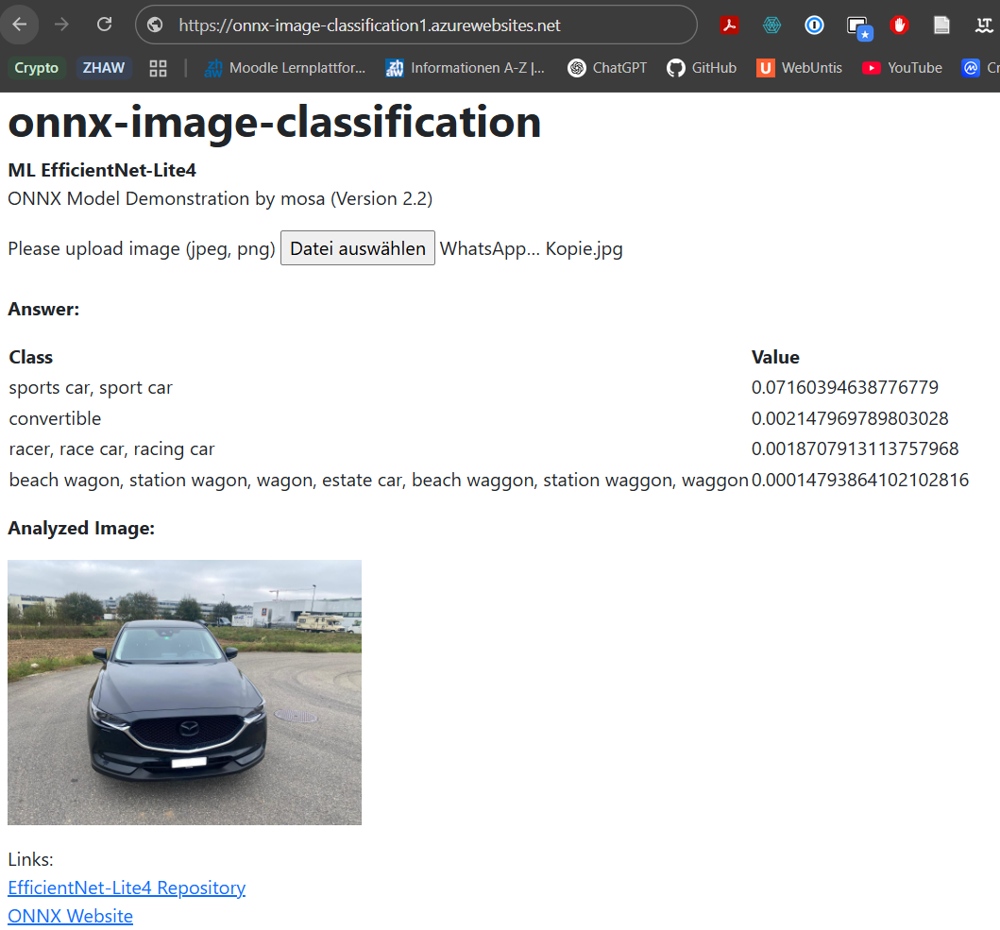
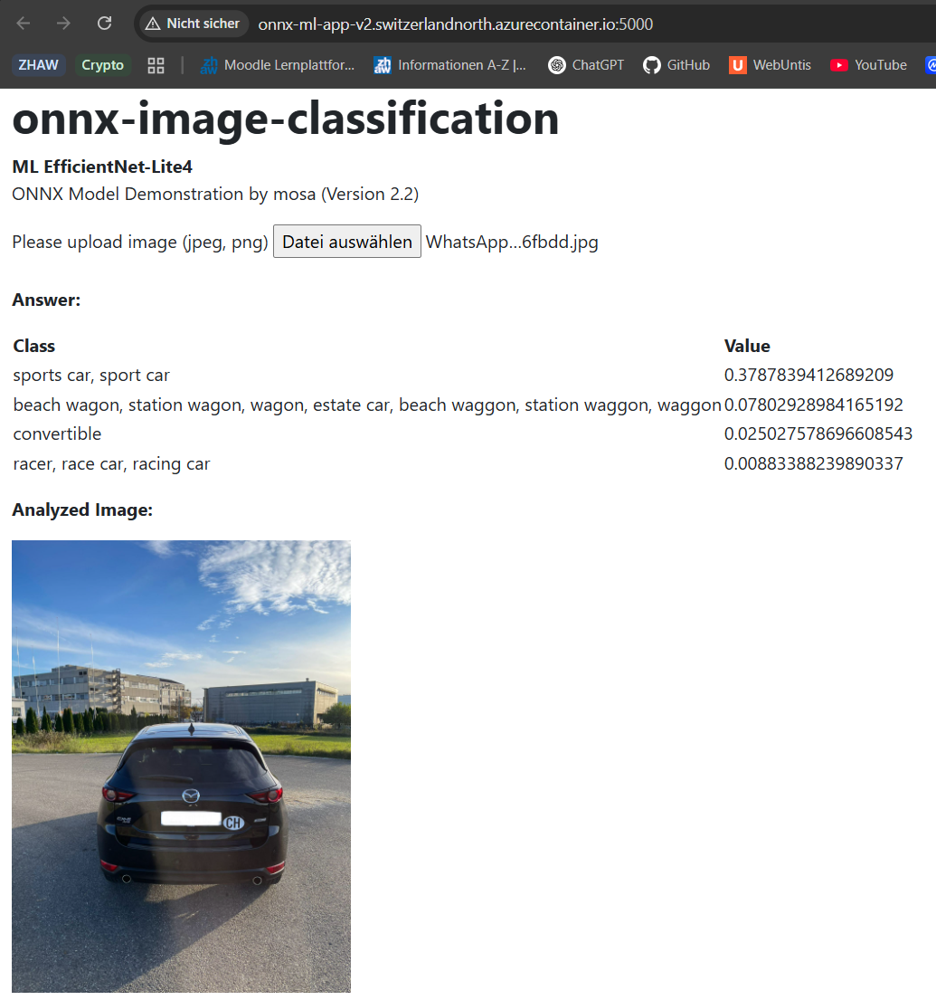

# Lernjournal 2 Container

## Docker Web-Applikation

### Verwendete Docker Images

| | Bitte ausfüllen |
| -------- | ------- |
| Image 1 | Flask CSV Analyzer (Custom Image) |
| Image 1 | https://hub.docker.com/r/drit0n/flask-csv-analyzer |
| Image 2 | MongoDB Datenbank |
| Image 2 | https://hub.docker.com/_/mongo |
| ... | ... |
| Docker Compose | https://github.com/Drit0n/MDM-Lernjournal/blob/main/lernjournal2-container/docker-compose.yaml |

### Dokumentation manuelles Deployment (Flask + MongoDB)

Die CSV Analyzer Pro App ermöglicht es, CSV-Dateien hochzuladen, automatisch zu analysieren und fehlende Werte zu bereinigen. Numerische Spalten werden dabei mit dem Median ergänzt, während Textspalten fehlende Einträge mit „Unbekannt“ füllen. Nach der Analyse zeigt die App eine Zusammenfassung mit Spaltennamen, Datentypen und Korrekturen an und stellt eine Vorschau der bereinigten Daten bereit. Zusätzlich können die bereinigten CSV-Daten exportiert und die Analyseergebnisse in einer MongoDB-Datenbank gespeichert werden.



Lokales Docker-Image wird gebaut
```bash
docker build -t flask-csv-analyzer:latest .
```


Zunächst wird das Setup manuell mit `docker run` durchgeführt. Als Erstes wird die MongoDB-Datenbank gestartet:

```bash
docker run --name mongo-db -p 27017:27017 -d mongo:7.0
```
Dieser Befehl erstellt einen Container namens mongo-db, öffnet den Standardport `27017` und stellt eine MongoDB-Instanz im Hintergrund bereit. Anschliessend wird die Flask-Anwendung gestartet und mit der MongoDB-Instanz verknüpft:
```bash
docker run --name csv-analyzer -p 5000:5000 -e MONGO_URI=mongodb://mongo-db:27017/csv_analyzer --link mongo-db:mongo -v ${PWD}/uploads:/usr/src/app/uploads -v ${PWD}/web:/usr/src/app/web -d flask-csv-analyzer:latest
```

#### Hierbei wird Folgendes durchgeführt:

Der Container csv-analyzer wird erstellt und die Flask-App läuft auf `Port 5000`. 

Die Umgebungsvariable MONGO_URI wird gesetzt, um die Flask-App mit der MongoDB zu verbinden.

Die Docker-Volumes binden lokale Verzeichnisse für `uploads/` und `web/` in den Container ein.

Über `--link` mongo-db:mongo erfolgt die interne Vernetzung mit dem MongoDB-Container.


Nach dem Start beider Container ist die Anwendung unter **http://localhost:5000** erreichbar. Die CSV-Analysen werden nun in der MongoDB-Datenbank **csv_analyzer** gespeichert. Das manuelle Deployment erfolgt mit zwei separaten Containern.


### Dokumentation Docker-Compose Deployment (Flask + MongoDB)

Nach dem erfolgreichen manuellen Deployment wurde die Applikation zur besseren Wartbarkeit und Automatisierung auf ein Multi-Container-Setup mit Docker Compose umgestellt. Docker Compose ermöglicht es, mehrere Container inklusive Netzwerken und Volumes in einer einzigen Konfigurationsdatei zu definieren und gemeinsam zu starten.

#### Aufbau der [docker-compose.yaml](docker-compose.yaml)

##### Service 1: flask-app
Baut das Flask-App Docker-Image aus dem lokalen Dockerfile.

Öffnet den `Port 5000` für die Webanwendung.

Stellt sicher, dass der MongoDB-Container vor dem Start bereit ist (depends_on).

Die Umgebungsvariable MONGO_URI verbindet die App mit der MongoDB.

Lokale Verzeichnisse uploads/ und web/ werden als Volumes in den Container gemountet.

##### Service 2: mongo
Nutzt das offizielle mongo:7.0 Image.

Öffnet den MongoDB-Standardport `27017`.

Persistiert die Daten im Volume mongo-data, welches die Datenbankdaten ausserhalb des Containers speichert und vor Datenverlust schützt.


#### Deployment-Vorgehen:
Compose-Setup starten:

```bash
docker-compose up --build -d
```


#### Prüfen der laufenden Container:

```bash
docker-compose ps
```
#### Zugriff auf die Anwendung:

* Die Web-App ist unter http://localhost:5000 erreichbar.

* Die MongoDB-Datenbank läuft parallel und ist von der Flask-App intern erreichbar unter `mongodb://mongo:27017/csv_analyzer`.

## Deployment ML-App

### Variante und Repository

| Gewähltes Beispiel | Bitte ausfüllen |
| -------- | ------- |
| onnx-sentiment-analysis | Nein |
| onnx-image-classification | Ja |
| Repo URL Fork | https://github.com/Drit0n/onnx-image-classification|
| Docker Hub URL | https://hub.docker.com/r/drit0n/onnx-image-classification |

### Dokumentation lokales Deployment

**Dockerfile erstellen:** Stelle sicher, dass du ein korrektes Dockerfile im Repository hast, das alle notwendigen Abhängigkeiten installiert und die Anwendung für den Container-Betrieb vorbereitet.
```bash
docker build -t drit0n/onnx-image-classification:latest .
```


**Container starten:** Nach dem erfolgreichen Build des Docker-Images kannst du den Container lokal starten.
```bash
docker run --name onnx-image-classification -p 9000:5000 -d drit0n/onnx-image-classification
```


**Testen der Anwendung:** Die Anwendung sollte nun unter http://localhost:9000 erreichbar sein.


#### Docker Hub Deployment
```bash
docker login
```

**Docker Hub Image Push:** Sobald der lokale Build erfolgreich ist, solltest du das Docker-Image auf deinen Docker Hub-Account pushen:
```bash
docker push drit0n/onnx-image-classification:latest
```


### Dokumentation Deployment Azure Web App

#### Anmeldung bei Azure
Bevor du mit dem Deployment beginnst, melde dich über die Azure CLI bei deinem Azure-Konto an: `az login`


#### Ressourcengruppe erstellen
Zuerst musst du eine Ressourcengruppe auf Azure erstellen. Eine Ressourcengruppe ist ein Container, der alle zugehörigen Ressourcen für deine Anwendung enthält.
```bash
az group create --name ml-deployment --location switzerlandnorth
```
über https://portal.azure.com/#@zhaw.onmicrosoft.com/resource/subscriptions/f946d195-3496-4d0a-bfad-6ddd07d574ac/resourceGroups/ml-deployment/overview erhälst du die Übersicht der Ressourengruppe `ml-deployment` 


#### App Service Plan erstellen
Erstelle einen App Service Plan, der die Infrastruktur für die Web App bereitstellt. Für diese Anleitung verwenden wir den kostenlosen F1-Plan und setzen den Betrieb auf Linux:
```bash
az appservice plan create --name ml-app-plan --resource-group ml-deployment --sku F1 --is-linux
```
* `--sku F1:` Dies bedeutet, dass der F1-Plan verwendet wird (kostenlos).

* `--is-linux:` Wir setzen die Web App auf Linux, da Docker-Container auf Linux basieren.

#### Web App erstellen und mit Docker-Image verbinden
Nun erstellen wir die Web App und verknüpfen sie mit dem Docker-Image aus Docker Hub. Ersetze drit0n/onnx-image-classification:latest durch den Namen deines Docker-Images, wenn du einen anderen Namen verwendest:
```bash
az webapp create --resource-group ml-deployment --plan ml-app-plan --name onnx-image-classification1 --deployment-container-image-name drit0n/onnx-image-classification:latest
```
* `--name onnx-image-classification1:` Der Name deiner Web App (wähle einen eindeutigen Namen, der noch nicht vergeben ist).

* `--deployment-container-image-name:` Hier gibst du das Docker-Image an, das du auf Docker Hub gehostet hast.

#### Port für Flask-App konfigurieren
Da Flask auf Port 5000 läuft, musst du den Port in den App-Einstellungen konfigurieren:
```bash
az webapp config appsettings set --resource-group ml-deployment --name onnx-image-classification1 --settings WEBSITES_PORT=5000
```
#### URL der Web App abrufen
Nachdem das Deployment abgeschlossen ist, kannst du die URL deiner Web App abrufen, die Azure für dich bereitgestellt hat:
```bash
az webapp show --resource-group ml-deployment --name onnx-image-classification1 --query "defaultHostName" -o tsv
```

* Diese URL sieht etwa so aus: `onnx-image-classification1.azurewebsites.net`. Deine Web App sollte nun unter dieser URL erreichbar sein.



#### Logs überprüfen
Falls es bei der Web App zu Problemen kommt, kannst du die Logs in Echtzeit überprüfen:

Dieser Befehl zeigt dir die neuesten Logs deiner Azure Web App an. Achte auf Fehler oder Probleme, die auftreten könnten, und behebe diese gegebenenfalls.
```bash
az webapp log tail --resource-group ml-deployment --name onnx-image-classification1
```

### Dokumentation Deployment ACA
In diesem Abschnitt wird beschrieben, wie du deine **onnx-image-classification**-Anwendung auf **Azure Container Apps (ACA)** bereitstellst.

#### Azure Container Apps Umgebung erstellen
Bevor du mit dem Deployment beginnst, musst du eine **Container App Umgebung** erstellen, in der deine Container-Anwendung laufen wird. Dies wird mit dem folgenden Befehl erledigt:
```bash
az containerapp env create --name ml-container-env --resource-group ml-deployment --location switzerlandnorth
```
Troubleshooting: `az provider register -n Microsoft.OperationalInsights --wait`, wenn Subscription nicht für den Microsoft.OperationalInsights-Ressourcenanbieter registriert ist, was für die Nutzung von Log Analytics erforderlich ist.

* `--name ml-container-env:` Der Name der Container App Umgebung (wähle einen eindeutigen Namen).
* `--resource-group ml-deployment:` Die Ressourcengruppe, die alle zugehörigen Azure-Ressourcen enthält.
* `--location switzerlandnorth:` Der Azure-Region, in der die Container App Umgebung bereitgestellt wird (du kannst die Region nach Bedarf anpassen).

#### ML-Anwendung als Azure Container App 
Nun wird das Docker-Image aus Docker Hub in die Azure Container Apps-Umgebung deployed. Du kannst das Docker-Image, das du bereits auf Docker Hub gepusht hast, verwenden. Der folgende Befehl führt das Deployment durch: 
```bash
az containerapp create --name onnx-image-classification-aca --resource-group ml-deployment \
--environment ml-container-env --image drit0n/onnx-image-classification:latest \
--target-port 5000 --ingress external
```
* `--name onnx-image-classification-aca:` Der Name deiner Container App (wähle einen eindeutigen Namen).
* `--resource-group ml-deployment:` Die Ressourcengruppe, in der die Container App bereitgestellt wird.
* `--environment ml-container-env:` Die zuvor erstellte Container App Umgebung.
* `--image drit0n/onnx-image-classification:latest:` Das Docker-Image, das du von Docker Hub verwendest (ersetze diesen mit deinem eigenen Docker-Image, wenn du einen anderen Namen verwendest).
* `--target-port 5000:` Der Port, auf dem deine Anwendung im Container läuft (Flask verwendet standardmäßig Port 5000).
* `--ingress external:` Dies bedeutet, dass die Anwendung extern zugänglich ist.

#### URL der Container App abrufen
Nach erfolgreichem Deployment kannst du die öffentliche URL der Container App abrufen. Diese URL gibt an, wie du auf deine Anwendung zugreifen kannst:
```bash
az containerapp show --name onnx-image-classification-aca --resource-group ml-deployment --query "properties.configuration.ingress.fqdn" -o tsv
```
**Ausgabe**: onnx-image-classification-aca.politecoast-92a46588.switzerlandnorth.azurecontainerapps.io

#### Logs und Troubleshooting
alls du beim Deployment oder Betrieb der Container App auf Probleme stösst, kannst du die Logs zur Diagnose abrufen. Um die Logs für die Container App in Azure zu überprüfen, führe den folgenden Befehl aus:
```bash
az containerapp logs show --name onnx-image-classification-aca --resource-group ml-deployment --follow
```


### Dokumentation Deployment ACI

#### Azure Container Instance erstellen

Zuerst musst du die **Azure Container Instance (ACI)** erstellen, in der deine Anwendung laufen wird. Verwende den folgenden Befehl:

```bash
az container create --resource-group ml-deployment --name onnx-image-classification-aci \
--image drit0n/onnx-image-classification:latest --dns-name-label onnx-ml-app \
--ports 5000 --cpu 1 --memory 1.5 --os-type Linux
```
* `--resource-group ml-deployment:` Die Ressourcengruppe, in der die ACI bereitgestellt wird.

* `--name onnx-image-classification-aci:` Der Name der Container-Instanz.

* `--image drit0n/onnx-image-classification:latest:` Das Docker-Image aus Docker Hub (ersetze diesen mit deinem eigenen Docker-Image, falls du einen anderen Namen verwendest).

* `--dns-name-label onnx-ml-app:` Der DNS-Name für die Container Instanz (dies wird verwendet, um die öffentliche URL zu erstellen).

* `--ports 5000:` Der Port, auf dem deine Anwendung läuft (Flask verwendet standardmäßig Port 5000).

* `--cpu 1 --memory 1.5:` Weisen Sie der Container Instanz 1 CPU und 1.5 GB RAM zu.

* `--os-type Linux:` Gibt an, dass die Container Instanz auf einem Linux-basierten Betriebssystem läuft.

#### URL ACI-Instanz abrufen
Nachdem das Deployment abgeschlossen ist, kannst du die öffentliche URL der ACI-Instanz abrufen:
```bash
az container show --resource-group ml-deployment --name onnx-image-classification-aci --query "ipAddress.fqdn" -o tsv
```

**Ausgabe**: [onnx-ml-app-v2.switzerlandnorth.azurecontainer.io](http://onnx-ml-app-v2.switzerlandnorth.azurecontainer.io:5000)

