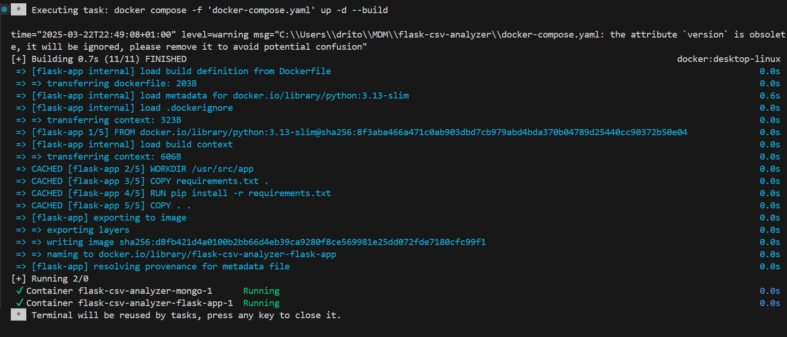

# Lernjournal 2 Container

## Docker Web-Applikation

### Verwendete Docker Images

| | Bitte ausfüllen |
| -------- | ------- |
| Image 1 | Name/Bezeichnung |
| Image 1 | URL Docker Hub |
| Image 2 | Name/Bezeichnung |
| Image 2 | URL Docker Hub |
| ... | ... |
| Docker Compose | URL Github Repo |

### Dokumentation manuelles Deployment (Flask + MongoDB)

Lokales Docker-Image wird gebaut
```bash
docker build -t flask-csv-analyzer:latest .
```


Zunächst wird das Setup manuell mit docker run durchgeführt. Als Erstes wird die MongoDB-Datenbank gestartet:

```bash
docker run --name mongo-db -p 27017:27017 -d mongo:7.0
```
Dieser Befehl erstellt einen Container namens mongo-db, öffnet den Standardport 27017 und stellt eine MongoDB-Instanz im Hintergrund bereit.

Anschliessend wird die Flask-Anwendung gestartet und mit der MongoDB-Instanz verknüpft:
```bash
docker run --name csv-analyzer -p 5000:5000 -e MONGO_URI=mongodb://mongo-db:27017/csv_analyzer --link mongo-db:mongo -v ${PWD}/uploads:/usr/src/app/uploads -v ${PWD}/web:/usr/src/app/web -d flask-csv-analyzer:latest
```

Hierbei wird Folgendes durchgeführt:

Der Container csv-analyzer wird erstellt und die Flask-App läuft auf **Port 5000.** 

Die Umgebungsvariable MONGO_URI wird gesetzt, um die Flask-App mit der MongoDB zu verbinden.

Die Docker-Volumes binden lokale Verzeichnisse für uploads/ und web/ in den Container ein.

Über **--link** mongo-db:mongo erfolgt die interne Vernetzung mit dem MongoDB-Container.


Nach dem Start beider Container ist die Anwendung unter **http://localhost:5000** erreichbar. Die CSV-Analysen werden nun in der MongoDB-Datenbank **csv_analyzer** gespeichert. Das manuelle Deployment erfolgt mit zwei separaten Containern.

### Dokumentation Docker-Compose Deployment (Flask + MongoDB)

Nach dem erfolgreichen manuellen Deployment wurde die Applikation zur besseren Wartbarkeit und Automatisierung auf ein Multi-Container-Setup mit Docker Compose umgestellt. Docker Compose ermöglicht es, mehrere Container inklusive Netzwerken und Volumes in einer einzigen Konfigurationsdatei zu definieren und gemeinsam zu starten.




## Deployment ML-App

### Variante und Repository

| Gewähltes Beispiel | Bitte ausfüllen |
| -------- | ------- |
| onnx-sentiment-analysis | Ja/Nein |
| onnx-image-classification | Ja/Nein |
| Repo URL Fork | URL |
| Docker Hub URL | URL |

### Dokumentation lokales Deployment

* [ ] TODO

### Dokumentation Deployment Azure Web App

* [ ] TODO

### Dokumentation Deployment ACA

* [ ] TODO

### Dokumentation Deployment ACI

* [ ] TODO