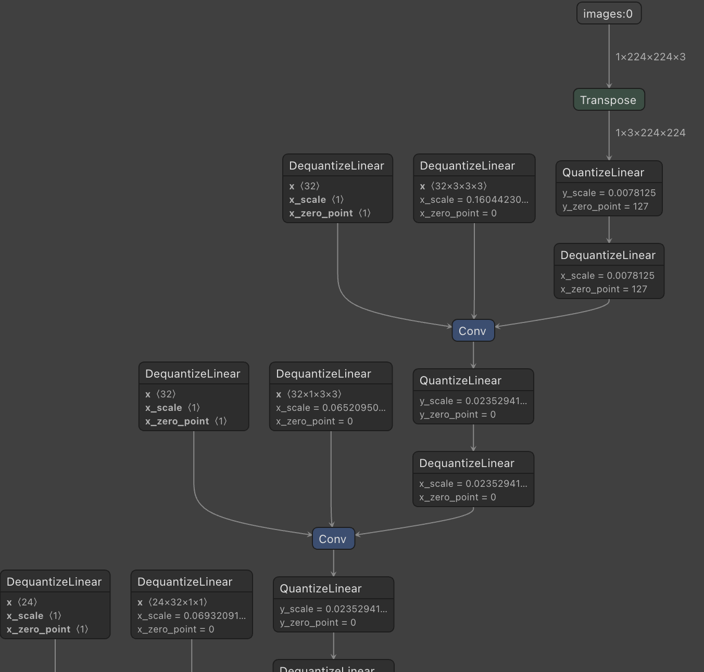

# Lernjournal 3 ONNX

## Übersicht

| | Bitte ausfüllen |
| -------- | ------- |
| ONNX Modell für Analyse (Netron) | https://github.com/onnx/models/blob/main/validated/vision/classification/efficientnet-lite4/model/efficientnet-lite4-11.onnx |
| onnx-image-classification Fork (EfficientNet-Lite) | https://github.com/Drit0n/onnx-image-classification |

## Dokumentation ONNX Analyse

### 🧠 ONNX-Modellanalyse mit Netron

Zur Analyse wurde das Modell [`efficientnet-lite4`](https://github.com/onnx/models/blob/main/validated/vision/classification/efficientnet-lite4/model/efficientnet-lite4-11.onnx) aus dem ONNX Model Zoo verwendet. Dieses ist quantisiert (QDQ – Quantize/Dequantize) und auf Effizienz optimiert.

### 🔍 Vorgehen

1. **Modell geöffnet mit [Netron](https://netron.app)**  
   Visualisierung der Layerstruktur und Datenflüsse im Netzgraph.

2. **Wichtige Layer (Beispiele):**
   - **Transpose**: Formatanpassung (NHWC → NCHW)
   - **QDQ-Kette**: `DequantizeLinear → Conv → QuantizeLinear` – rechenoptimierte Verarbeitung
   - **Residualblöcke**: Wiederholte Muster mit Conv, BatchNorm, Relu

   

3. **Beobachtungen:**
   - Das Modell nutzt modulare Blöcke, ideal für mobile Nutzung
   - Finaler `Gemm`-Layer liefert die Klassifikation (ImageNet)

### 🧰 Tools

- **Netron**: Visualisierung der Tensorformen, Operatoren & Verbindungen
- Analyse erlaubt Einblick in Struktur, Effizienz und Aufbau moderner ONNX-Modelle

## Dokumentation onnx-image-classification

* [ ] TODO