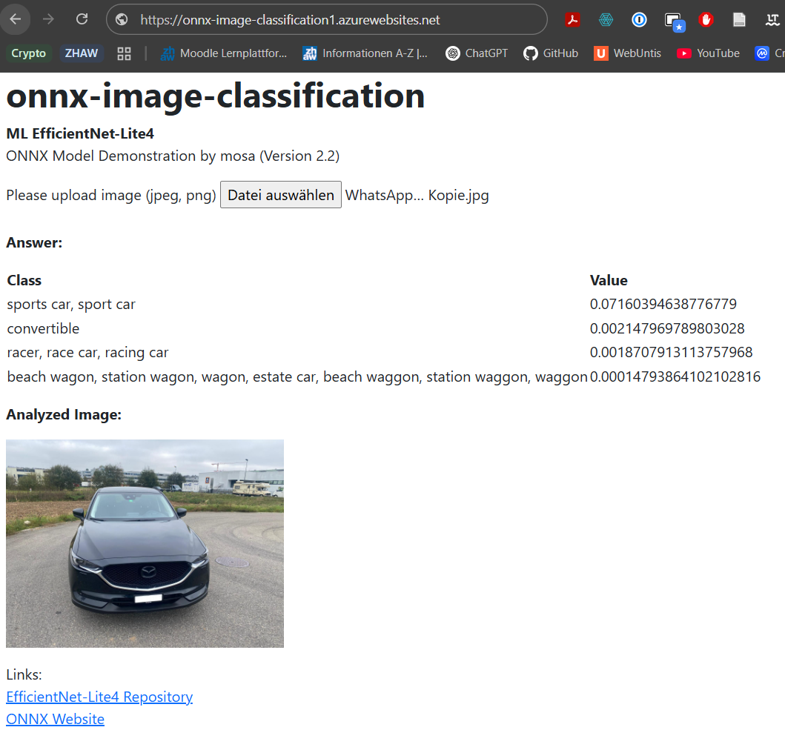
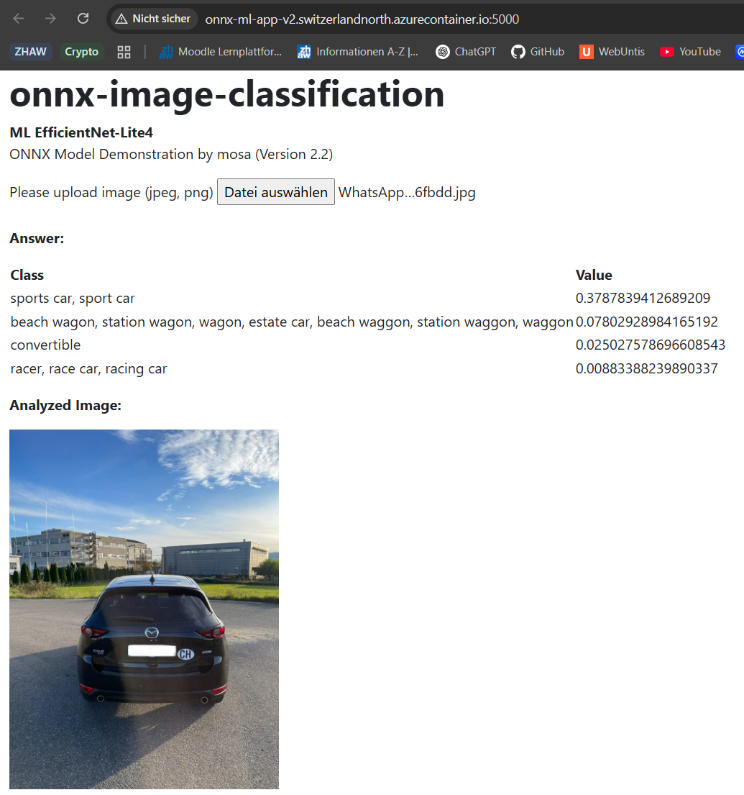

# Lernjournal 3 ONNX

## Übersicht

| | Bitte ausfüllen |
| -------- | ------- |
| ONNX Modell für Analyse (Netron) | https://github.com/onnx/models/blob/main/validated/vision/classification/efficientnet-lite4/model/efficientnet-lite4-11.onnx |
| onnx-image-classification Fork (EfficientNet-Lite) | https://github.com/Drit0n/onnx-image-classification |

## Dokumentation ONNX Analyse

### 🧠 ONNX-Modellanalyse mit Netron

Zur Analyse wurde das Modell [`efficientnet-lite4`](https://github.com/onnx/models/blob/main/validated/vision/classification/efficientnet-lite4/model/efficientnet-lite4-11.onnx) aus dem ONNX Model Zoo verwendet. Dieses ist quantisiert (QDQ – Quantize/Dequantize) und auf Effizienz optimiert.

### 🔍 Vorgehen

1. **Modell geöffnet mit [Netron](https://netron.app)**  
   Visualisierung der Layerstruktur und Datenflüsse im Netzgraph.

2. **Wichtige Layer (Beispiele):**
   - **Transpose**: Formatanpassung (NHWC → NCHW)
   - **QDQ-Kette**: `DequantizeLinear → Conv → QuantizeLinear` – rechenoptimierte Verarbeitung
   - **Residualblöcke**: Wiederholte Muster mit Conv, BatchNorm, Relu

   

3. **Beobachtungen:**
   - Das Modell nutzt modulare Blöcke, ideal für mobile Nutzung
   - Finaler `Gemm`-Layer liefert die Klassifikation (ImageNet)

### 🧰 Tools

- **Netron**: Visualisierung der Tensorformen, Operatoren & Verbindungen
- Analyse erlaubt Einblick in Struktur, Effizienz und Aufbau moderner ONNX-Modelle

## 📄 Dokumentation onnx-image-classification

Im Rahmen dieses Projekts wurde das Repository [`onnx-image-classification`](https://github.com/Drit0n/onnx-image-classification) verwendet, um verschiedene ONNX-Modelle zur Bildklassifikation zu testen und zu vergleichen.

---

## 🛠️ Einrichtung & verwendete Modelle

### Fork & Lokales Setup

Zunächst wurde das Originalprojekt geforkt, um eigene Anpassungen sowie Analysen durchführen zu können.  
➡️ Mein Fork: [Drit0n/onnx-image-classification](https://github.com/Drit0n/onnx-image-classification)

Das geklonte Projekt wurde anschließend lokal eingerichtet:

```bash
git clone https://github.com/Drit0n/onnx-image-classification.git
cd onnx-image-classification
```

##  Vergleich der verwendeten ONNX-Modelle

Im Rahmen dieses Projekts wurden drei unterschiedliche Varianten des Modells `EfficientNet-Lite4` in ONNX-Format untersucht. Alle basieren auf derselben Architektur, unterscheiden sich jedoch im Hinblick auf Genauigkeit, Rechenleistung und Speicherverbrauch. Dies ist insbesondere relevant für Anwendungen auf ressourcenschwacher Hardware (z. B. Embedded-Geräte, Smartphones).

### 🔬 Hintergrund zur Quantisierung

Quantisierung ist ein Verfahren zur Reduktion der Modellgröße und zur Beschleunigung der Inferenzzeit, indem Gleitkommazahlen (z. B. `float32`) durch kleinere ganzzahlige Datentypen (z. B. `int8`) ersetzt werden. Dabei entsteht ein Kompromiss zwischen Genauigkeit und Effizienz.

---

### 📊 Modellübersicht & Bewertung

| Modellname | Beschreibung | Vorteile | Einschränkungen | Download |
|------------|--------------|----------|------------------|----------|
| **efficientnet-lite4-11.onnx** | Voll präzises Modell (FP32), wie aus dem ONNX Model Zoo bezogen | Sehr hohe Genauigkeit, stabil bei der Klassifikation | Relativ große Dateigröße und längere Lade-/Inferenzzeit | [🔗 Download](https://github.com/onnx/models/blob/main/validated/vision/classification/efficientnet-lite4/model/efficientnet-lite4-11.onnx) |
| **efficientnet-lite4-11-qdq.onnx** | Version mit Quantize-Dequantize (QDQ) Blöcken zur Optimierung für mobile Geräte | Kleinere Modellgröße, bessere Performance auf Edge-Hardware, kaum Genauigkeitsverlust | Leichte Reduktion der Präzision möglich | [🔗 Download](https://github.com/onnx/models/pull/492) |
| **efficientnet-lite4-11-int8.onnx** | Stärker quantisiertes Modell mit INT8-Werten, vollständig für Inferenzen auf Embedded-Geräten optimiert | Sehr geringe Größe, schnellste Ausführung, ideal für ressourcenarme Systeme | Spürbarer Genauigkeitsverlust bei bestimmten Bildtypen | [🔗 Download](https://github.com/onnx/models/pull/492) |

---

### 🧪 Anwendung im Projekt

Alle drei Modelle wurden im Rahmen der `onnx-image-classification`-App eingebunden und getestet. Ziel war es, die Unterschiede in folgenden Aspekten herauszuarbeiten:

- **Ladezeit und Speicherbedarf** (besonders relevant für mobile Geräte)
- **Inference-Zeit pro Bild** (Messung mit mehreren Testbildern)
- **Vorhersagegenauigkeit** (subjektiv geprüft anhand bekannter Testbilder)




> 🔍 **Beobachtung:** Während das FP32-Modell die beste Vorhersagequalität lieferte, bot die INT8-Variante die höchste Geschwindigkeit bei spürbar reduzierter Dateigröße. Das QDQ-Modell erwies sich als ausgewogener Mittelweg.

---

### 📝 Fazit

Die Wahl des Modells hängt stark vom Einsatzkontext ab:
- Für Desktop- oder serverbasierte Anwendungen: **FP32-Modell**
- Für mobile oder IoT-Geräte: **QDQ oder INT8**
- Wenn Genauigkeit im Vordergrund steht: **FP32**
- Wenn Effizienz und Geschwindigkeit entscheidend sind: **INT8**

Das Projekt verdeutlicht gut, wie quantisierte ONNX-Modelle eine Brücke zwischen Leistung und Ressourcenoptimierung schlagen.
