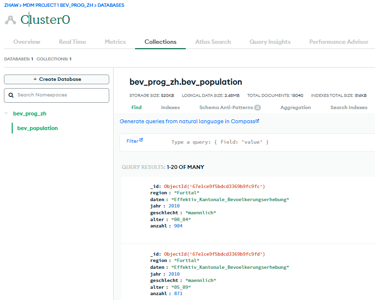
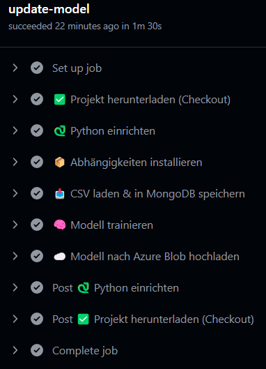

# Projekt 1 Python

## Übersicht

| | Bitte ausfüllen |
| -------- | ------- |
| Variante | Eigenes Projekt: Bevölkerungsprognose des Kantons Zürich |
| Datenherkunft | HTML (unstrukturiertes HTML mit eingebettetem CSV-Link) |
| Datenherkunft | https://opendata.swiss/de/dataset/zukunftige-bevolkerung-kanton-zurich-und-regionen-nach-geschlecht-und-alter/resource/ad753801-25e7-4bce-b8ab-a704962c95de|
| ML-Algorithmus | Prophet (Time Series Forecasting) |
| Repo URL | https://github.com/drit0n/bev-prog-zh-v2 |

## 📄 Dokumentation

Dieses Projekt bildet den vollständigen End-to-End-Workflow eines datengetriebenen Prognosesystems ab – von der automatisierten Datenerfassung über Machine-Learning-Training bis hin zum CI/CD Deployment auf Azure. Es wurde modular, automatisierbar und im Clean-Code-Stil aufgebaut.

### 🔎 Data Scraping

Für meine Applikation habe ich mit Scrapy einen Spider **open_data_scraper.py** entwickelt, der den CSV-Link aus der HTML-Struktur von opendata.swiss extrahiert. Dort wird die relevante CSV-Datei in einer Tabelle mit der Bezeichnung „Download-URL“ eingebettet.
Der Spider erkennt den Link automatisch, lädt die Datei über pandas direkt als DataFrame ein und bereinigt diese.

Die Daten (Bevölkerungsstatistiken des Kantons Zürich mit Attributen wie Region, Altersgruppe, Jahr und Anzahl) werden nach der Extraktion direkt in eine MongoDB Atlas-Datenbank importiert.

Der MongoDB-Import erfolgt vollautomatisiert durch denselben Spider, der die CSV-Daten als DataFrame verarbeitet und speichert. So steht die Datenbasis konsistent und tagesaktuell zur Verfügung.

Die GitHub Actions Pipeline **open_data_scraper.yml** ermöglicht zudem ein geplantes oder eventbasiertes Scraping, das ohne manuelles Eingreifen abläuft.

### 🧠 Training

Nach dem erfolgreichen Import in MongoDB wird für jede Kombination von Region und Altersgruppe ein separates Prophet-Modell trainiert.

Ein separates Skript **model.py** + **forecast.py** übernimmt die automatisierte Durchführung:

* Es liest alle relevanten Daten aus MongoDB,

* filtert sie nach Region und Altersgruppe,

* und trainiert Prophet-Modelle auf dieser Basis.

Die trainierten Modelle werden als Pickle-Dateien (.pkl) im Verzeichnis /backend/static/ abgelegt, um sie in der Flask-App schnell laden zu können – ohne unnötige Rechenzeit im Livebetrieb.

📌 Alle Modelle werden in einem Batch-Prozess automatisiert erstellt.
📌 Der Prognosehorizont ist im Frontend durch die Nutzer:innen einstellbar (5, 10, 15 Jahre).

### ⚙️ ModelOps Automation

Ein zusätzliches Skript (train_and_deploy.py) sorgt dafür, dass nach jedem Scraping- und Importvorgang alle Modelle erneut trainiert und versioniert werden.

Zudem existieren zwei dedizierte GitHub Actions Workflows:

* model.yml: automatisiert das Training aller Forecast-Modelle und speichert sie in die App

📌 Die CI/CD-Pipeline sorgt für einen komplett automatisierten Daten- und Modell-Lifecycle – im Sinne moderner ModelOps-Prinzipien.

### Deployment

Das Backend wurde mit Flask in modularer Blueprint-Architektur entwickelt. Es stellt verschiedene API-Endpunkte bereit, die Forecast-Daten und dynamische Insights an das Frontend übermitteln.

Das Frontend basiert auf Flask (Jinja2) und Bootstrap, um eine responsive Nutzeroberfläche bereitzustellen.
Nutzer:innen wählen Region, Altersgruppe und Zeitraum, woraufhin die Ergebnisse als interaktive Plotly-Grafiken und dynamische Insight-Boxen angezeigt werden.

Deployment erfolgt containerisiert auf Azure App Service:

* Das Backend wird als Docker-Image über ein Dockerfile gebaut.

* Der automatisierte Rollout erfolgt via GitHub Actions Deployment-Workflow.

* MongoDB Atlas dient als produktive Cloud-Datenquelle.

### 📈 Features der App

🔎 Region, Altersgruppe & Zeitraum auswählbar

📉 Plotly-Visualisierung (historisch + prognostiziert)

📦 Insight-Boxen diversen Angaben wie:

* Langfristigem Entwicklungstrend
* Prognosewachstum 2025–2050
* Grösster Altersgruppe im aktuellen Jahr
* Jahr mit dem höchsten Wachstum