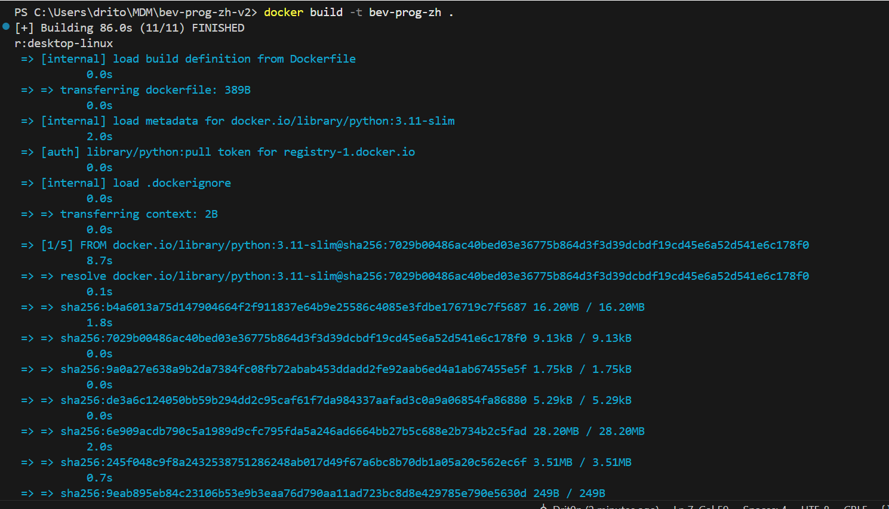
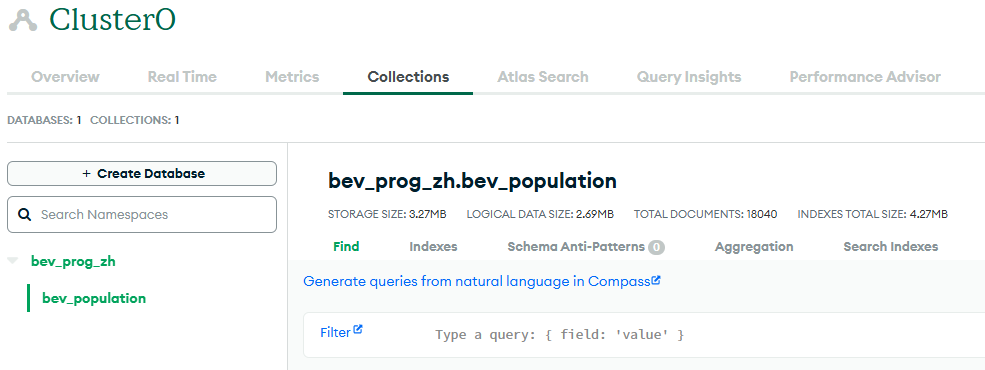
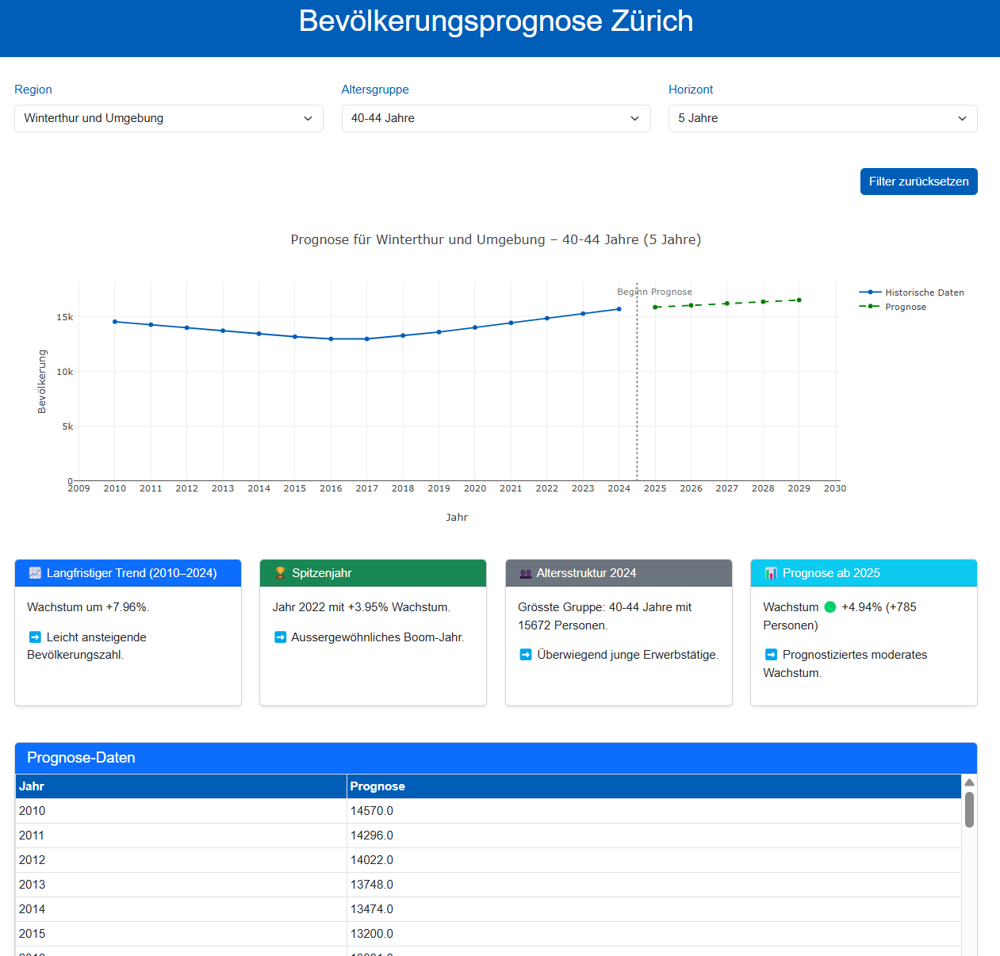

# Projekt 1 Python

## Übersicht

| | Bitte ausfüllen |
| -------- | ------- |
| Variante | Eigenes Projekt: Bevölkerungsprognose des Kantons Zürich |
| Datenherkunft | HTML (unstrukturiertes HTML mit eingebettetem CSV-Link) |
| Datenherkunft | https://opendata.swiss/de/dataset/zukunftige-bevolkerung-kanton-zurich-und-regionen-nach-geschlecht-und-alter/resource/ad753801-25e7-4bce-b8ab-a704962c95de|
| ML-Algorithmus | Prophet (Time Series Forecasting) |
| Repo URL | https://github.com/drit0n/bev-prog-zh-v2 |

## 📄 Dokumentation

Dieses Projekt bildet den vollständigen End-to-End-Workflow eines datengetriebenen Prognosesystems ab – von der automatisierten Datenerfassung über Machine-Learning-Training bis hin zum CI/CD Deployment auf Azure. Es wurde modular, automatisierbar und im Clean-Code-Stil aufgebaut.

### 🔎 Data Scraping

Für meine Applikation habe ich mit Scrapy einen Spider **open_data_scraper.py** entwickelt, der den CSV-Link aus der HTML-Struktur von opendata.swiss extrahiert. Dort wird die relevante CSV-Datei in einer Tabelle mit der Bezeichnung „Download-URL“ eingebettet.
Der Spider erkennt den Link automatisch, lädt die Datei über pandas direkt als DataFrame ein und bereinigt diese.

Die Daten (Bevölkerungsstatistiken des Kantons Zürich mit Attributen wie Region, Altersgruppe, Jahr und Anzahl) werden nach der Extraktion direkt in eine MongoDB Atlas-Datenbank importiert.

Der MongoDB-Import erfolgt vollautomatisiert durch denselben Spider, der die CSV-Daten als DataFrame verarbeitet und speichert. So steht die Datenbasis konsistent und tagesaktuell zur Verfügung.

***open_data_scraper.py***
````bash
import pandas as pd
from pymongo import MongoClient
import os
import requests
from io import StringIO

# ✅ CSV herunterladen
csv_url = "https://www.web.statistik.zh.ch/ogd/daten/ressourcen/KTZH_00000705_00005785.csv"
response = requests.get(csv_url)
response.encoding = 'latin1'  # Wichtige Einstellung für die Zeichencodierung

# ✅ CSV-Text in Zeilen aufteilen und Header bereinigen
lines = response.text.splitlines()
if lines:
    # Entferne alle Anführungszeichen aus der Header-Zeile
    header = lines[0].replace('"', '')
    lines[0] = header
csv_data = "\n".join(lines)
csv_io = StringIO(csv_data)

# ✅ CSV korrekt einlesen – Trennzeichen ist ein Komma
df = pd.read_csv(csv_io, sep=',')

# 🔍 Spaltennamen bereinigen
df.columns = df.columns.str.strip().str.lower()

# 🧠 'jahr'-Spalte checken
if 'jahr' not in df.columns:
    print("❌ Spalte 'jahr' nicht gefunden. Gefundene Spalten:", df.columns.tolist())
    exit(1)

df['jahr'] = df['jahr'].astype(int)

# ☁️ Mit MongoDB verbinden
mongo_uri = os.getenv("MONGO_URI")
if not mongo_uri:
    print("❌ MONGO_URI Umgebungsvariable ist nicht gesetzt.")
    exit(1)

client = MongoClient(mongo_uri)
db = client["bev_prog_zh"]
collection = db["bev_population"]

# Vorherige Datensätze löschen und neue einfügen
collection.delete_many({})
collection.insert_many(df.to_dict(orient="records"))

print(f"✅ {len(df)} Datensätze erfolgreich in MongoDB importiert.")
print("✅ Datenbank-Import erfolgreich!")

````


Die GitHub Actions Pipeline **model.yml** ermöglicht zudem ein geplantes oder eventbasiertes Scraping, das ohne manuelles Eingreifen abläuft.

### 🧠 Training

Nach dem erfolgreichen Import in MongoDB wird für jede Kombination von Region und Altersgruppe ein separates Prophet-Modell trainiert.

Ein separates Skript **model.py** + **forecast.py** übernimmt die automatisierte Durchführung:

* Es liest alle relevanten Daten aus MongoDB,

* filtert sie nach Region und Altersgruppe,

* und trainiert Prophet-Modelle auf dieser Basis.

Die trainierten Modelle werden als Pickle-Dateien (.pkl) im Verzeichnis `/backend/static/` abgelegt, um sie in der Flask-App schnell laden zu können – ohne unnötige Rechenzeit im Livebetrieb.

📌 Alle Modelle werden in einem Batch-Prozess automatisiert erstellt.
📌 Der Prognosehorizont ist im Frontend durch die Nutzer:innen einstellbar (5, 10, 15, 20 Jahre).


***model.py***
Dieses Python-Programm trainiert mit Prophet für jede Kombination aus Region und Altersgruppe sowie für alle Daten ein kombiniertes Zeitreihenmodell auf Basis von Bevölkerungsdaten aus MongoDB und speichert die Modelle als Pickle-Dateien zur späteren Verwendung in der Web-App.

````bash
import pandas as pd
from prophet import Prophet
import pickle
import os
import sys

# Füge das übergeordnete Verzeichnis dem Suchpfad hinzu,
# sodass das 'backend'-Modul gefunden wird.
sys.path.append(os.path.abspath(os.path.join(os.path.dirname(__file__), '..')))

from backend.database import get_data  # Holt Daten direkt aus MongoDB

def train_model():
    try:
        # MongoDB-Daten laden
        df = get_data()  # alle Daten abrufen (ohne Filter)
        
        # Sicherstellen, dass Daten vorhanden sind
        if df.empty:
            print("⚠️ Keine Daten in der MongoDB vorhanden!")
            return
        
        # Output-Verzeichnis erstellen
        os.makedirs('backend/static', exist_ok=True)
        os.makedirs('model', exist_ok=True)  # <--- neu für combined model

        regions = df['region'].unique()
        ages = df['alter'].unique()

        for region in regions:
            for age in ages:
                df_sub = df[(df['region'] == region) & (df['alter'] == age)]
                if df_sub.empty:
                    print(f"⚠️  Keine Daten für {region} - {age}, überspringe...")
                    continue

                df_grouped = df_sub.groupby('jahr')['anzahl'].sum().reset_index()
                df_grouped.rename(columns={'jahr': 'ds', 'anzahl': 'y'}, inplace=True)
                df_grouped['ds'] = pd.to_datetime(df_grouped['ds'], format='%Y')

                # Prophet-Modell erstellen und trainieren
                model = Prophet(yearly_seasonality=False)
                model.fit(df_grouped)

                # Safe Filename erstellen
                region_safe = region.replace(" ", "_").replace("/", "_")
                model_path = f'backend/static/forecast_{region_safe}_{age}.pkl'
                with open(model_path, 'wb') as f:
                    pickle.dump(model, f)

                print(f"✅ Modell gespeichert für {region} - {age}")
        
        # 📦 Kombiniertes Modell über alle Daten
        print("🔄 Trainiere kombiniertes Gesamtmodell über alle Daten...")
        df_all = df.groupby('jahr')['anzahl'].sum().reset_index()
        df_all.rename(columns={'jahr': 'ds', 'anzahl': 'y'}, inplace=True)
        df_all['ds'] = pd.to_datetime(df_all['ds'], format='%Y')

        combined_model = Prophet(yearly_seasonality=False)
        combined_model.fit(df_all)

        combined_model_path = 'model/region_age_combined_model.pkl'
        with open(combined_model_path, 'wb') as f:
            pickle.dump(combined_model, f)

        print(f"✅ Kombiniertes Modell gespeichert unter {combined_model_path}")
                
    except Exception as e:
        print(f"Fehler: {str(e)}")

if __name__ == "__main__":
    train_model()
    print("✅ Modelltraining abgeschlossen!")
    print("✅ Alle Modelle erfolgreich trainiert und gespeichert.")
````

***forecast.py***
Dieses Python-Programm erstellt mit dem Prophet-Algorithmus eine Bevölkerungsprognose für eine gewählte Region und Altersgruppe über einen definierten Zeitraum, basierend auf MongoDB-Daten, und gibt die Vorhersageergebnisse als strukturierte Liste zurück.

````bash
import pandas as pd
from prophet import Prophet
from .database import get_data  # MongoDB-Datenquelle

def make_forecast(region, altersgruppe, horizon):
    # 🔵 Hole die Daten aus MongoDB
    df_filtered = get_data(region, altersgruppe)

    if df_filtered.empty:
        return []  # Keine Prognose möglich

    # Daten vorbereiten für Prophet
    df_grouped = df_filtered.groupby('jahr')['anzahl'].sum().reset_index()
    df_grouped.rename(columns={'jahr': 'ds', 'anzahl': 'y'}, inplace=True)
    df_grouped['ds'] = pd.to_datetime(df_grouped['ds'], format='%Y')

    # Prophet Modell trainieren
    model = Prophet(yearly_seasonality=False)
    model.fit(df_grouped)

    # Zukunftsdaten für den Forecast erstellen
    future = model.make_future_dataframe(periods=horizon, freq='YE')
    forecast = model.predict(future)

    return forecast[['ds', 'yhat', 'yhat_lower', 'yhat_upper']].to_dict(orient='records')

````

### ⚙️ ModelOps Automation

Ein zusätzliches Skript (train_and_deploy.py) sorgt dafür, dass nach jedem Scraping- und Importvorgang alle Modelle erneut trainiert und versioniert werden.

Zudem existieren zwei dedizierte GitHub Actions Workflows:

* model.yml: automatisiert das Training aller Forecast-Modelle und speichert sie in die App

📌 Die CI/CD-Pipeline sorgt für einen komplett automatisierten Daten- und Modell-Lifecycle – im Sinne moderner ModelOps-Prinzipien.

***model.yml***

````bash
name: ModelOps (Update Model)

on:
  push:
    branches: [ main ]
  workflow_dispatch:

jobs:
  update-model:
    runs-on: ubuntu-latest

    steps:
      - name: ✅ Projekt herunterladen (Checkout)
        uses: actions/checkout@v3

      - name: 🐍 Python einrichten
        uses: actions/setup-python@v4
        with:
          python-version: '3.10'
          cache: 'pip'

      - name: 📦 Abhängigkeiten installieren
        run: |
          pip install --upgrade pip
          pip install -r requirements.txt

      - name: 📥 CSV laden & in MongoDB speichern
        env:
          MONGO_URI: ${{ secrets.MONGO_URI }}
        run: |
          if [ ! -f "scraper/open_data_scraper.py" ]; then
            echo "❌ Datei scraper/open_data_scraper.py nicht gefunden!"
            exit 1
          fi
          python scraper/open_data_scraper.py

      - name: 🧠 Modell trainieren
        env:
          MONGO_URI: ${{ secrets.MONGO_URI }}
        run: |
          if [ ! -f "backend/model.py" ]; then
            echo "❌ Datei backend/model.py nicht gefunden!"
            exit 1
          fi
          cd backend
          python model.py
          cd ..

      - name: ☁️ Modell nach Azure Blob hochladen
        env:
          AZURE_STORAGE_CONNECTION_STRING: ${{ secrets.AZURE_STORAGE_CONNECTION_STRING }}
        run: |
          if [ ! -f "model/save.py" ]; then
            echo "❌ Datei model/save.py nicht gefunden!"
            exit 1
          fi
          cd model
          python save.py -c "${AZURE_STORAGE_CONNECTION_STRING}"
          cd ..
````


### Deployment

Das Backend wurde mit Flask in modularer Blueprint-Architektur entwickelt. Es stellt verschiedene API-Endpunkte bereit, die Forecast-Daten und dynamische Insights an das Frontend übermitteln.

Das Frontend basiert auf Flask (Jinja2) und Bootstrap, um eine responsive Nutzeroberfläche bereitzustellen.
Nutzer:innen wählen Region, Altersgruppe und Zeitraum, woraufhin die Ergebnisse als interaktive Plotly-Grafiken und dynamische Insight-Boxen angezeigt werden.

Deployment erfolgt containerisiert auf Azure App Service:

* Das Backend wird als Docker-Image über ein Dockerfile gebaut.

***Dockerfile***

````bash
FROM python:3.10-slim

WORKDIR /app

COPY requirements.txt .
RUN pip install --no-cache-dir -r requirements.txt

COPY . .

EXPOSE 8000

CMD ["gunicorn", "-b", "0.0.0.0:8000", "wsgi:app"]
````



* Der automatisierte Rollout erfolgt via GitHub Actions Deployment-Workflow.


* MongoDB Atlas dient als produktive Cloud-Datenquelle.



* Versionierung durch Blobcontaier gespeichert.


* Deployment-Logs von der Web-App


### 📈 Features der App

🔎 Region, Altersgruppe & Zeitraum auswählbar

📉 Plotly-Visualisierung (historisch + prognostiziert)

📦 Insight-Boxen diversen Angaben wie:

* Langfristigem Entwicklungstrend
* Prognosewachstum 2025–2050
* Grösster Altersgruppe im aktuellen Jahr
* Jahr mit dem höchsten Wachstum



### 📚 Technologien
Komponente	Technologie
Web-Backend	Flask (Python)
Frontend & UI	Jinja2, Bootstrap, Plotly
Forecasting	Facebook Prophet
Datenhaltung	MongoDB Atlas
Scraping	Scrapy, Pandas
CI/CD	GitHub Actions
Containerization	Docker
Hosting	Azure App Service

### 🧠 Reflexion & Learnings
Durch die eigenständige Umsetzung dieses Projekts habe ich wertvolle Erfahrungen in der Verbindung von Datenverarbeitung, maschinellem Lernen und Webentwicklung gesammelt. Besonders hervorzuheben sind folgende Erkenntnisse:

✅ Scraping unstrukturierter HTML-Daten erfordert präzises DOM-Verständnis und robuste Automatisierung (Scrapy).

✅ Zeitreihenprognosen mit Prophet sind mächtig, aber auch sensibel gegenüber Datenqualität und Modellparametern.

✅ CI/CD mit GitHub Actions ermöglicht eine saubere Trennung zwischen Entwicklung und produktivem Einsatz – besonders wertvoll für ModelOps.

✅ Flask + Docker + Azure bieten eine flexible und skalierbare Infrastruktur für Webanwendungen im Data-Science-Kontext.

✅ Die Bedeutung von modularer Architektur und Clean Code wurde durch das Projekt nochmals deutlich – für Wartbarkeit und Erweiterbarkeit unverzichtbar.

Dieses Projekt hat mein Verständnis für End-to-End-Data-Science-Pipelines entscheidend vertieft – von der Datenquelle bis zur interaktiven Prognose im Web-Frontend.