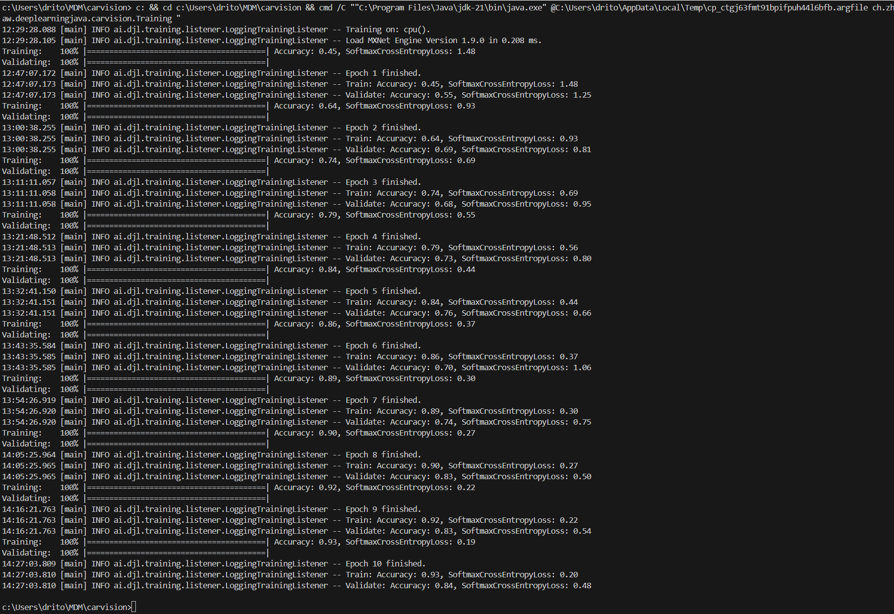
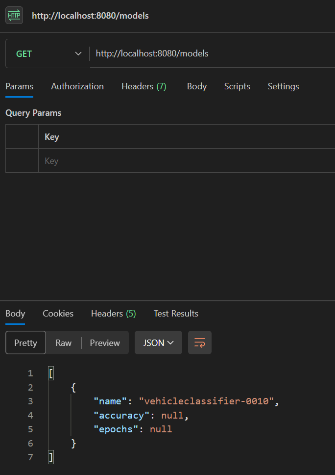
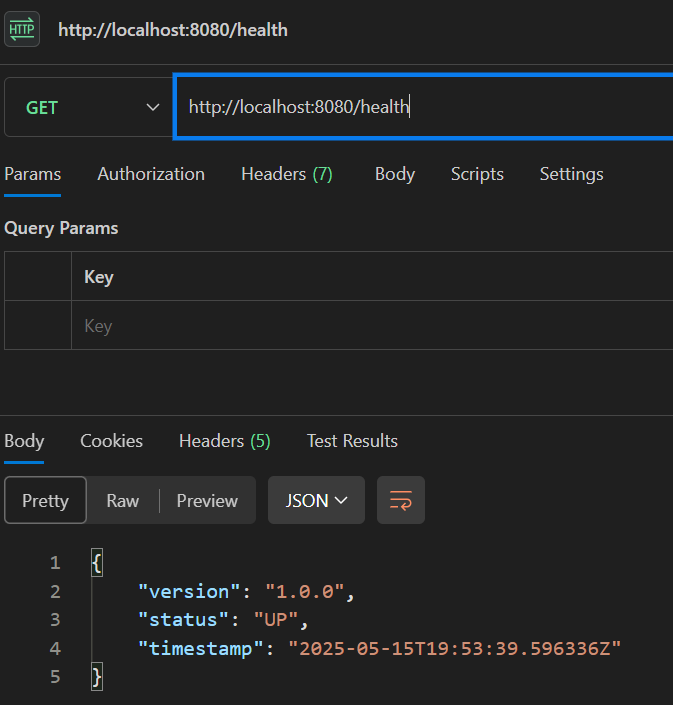
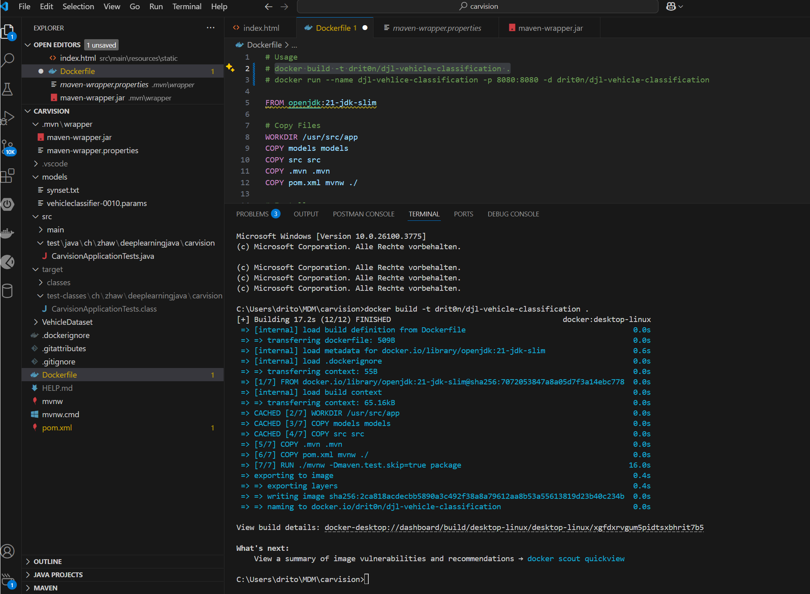
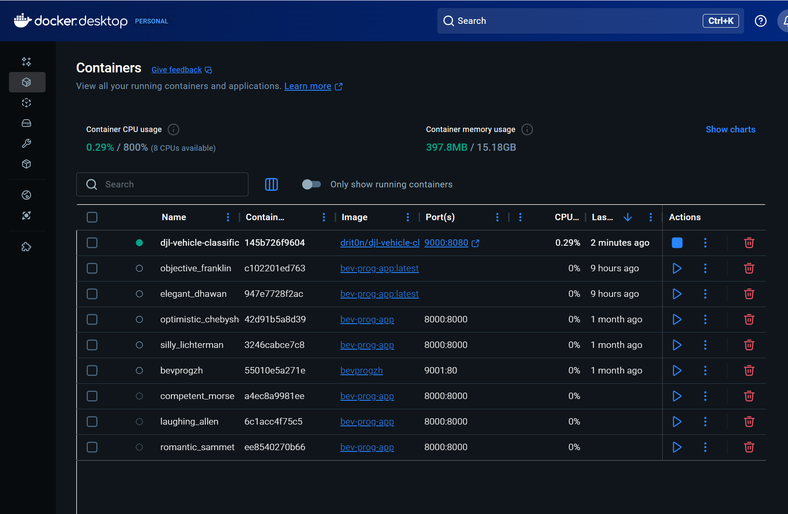
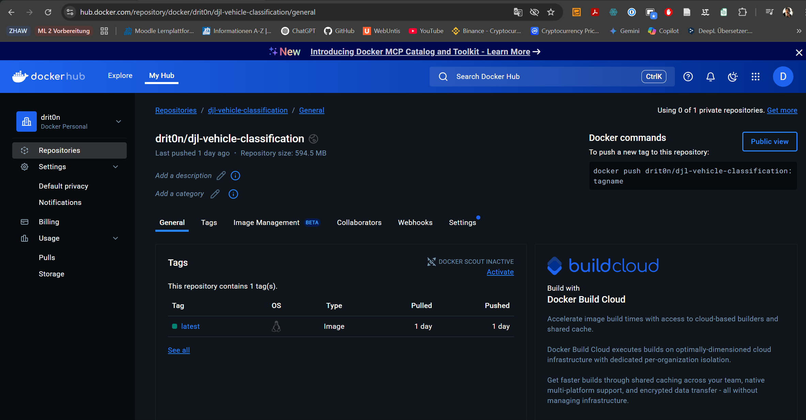
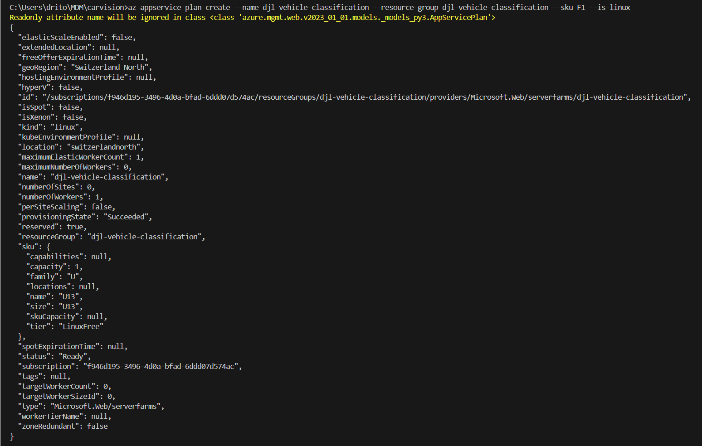
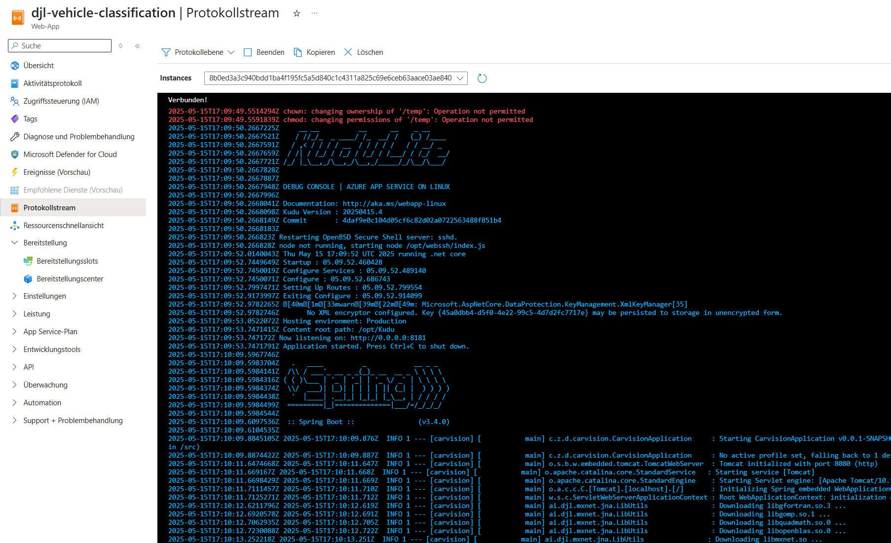

# Projekt 2 Java

## Übersicht

| | Bitte ausfüllen |
| -------- | ------- |
| Variante | Vorhandenes Modell ResNet50, selbst trainiert und auf eigenen Datensatz angewendet  |
| Datensatz (wenn selbstgewählt) | VehicleDataset, 7 Klassen (SUV, Sedan, Truck, etc.), Format: JPG, Autobahnbilder mit Fahrzeugtyp-Labels |
| Datensatz (wenn selbstgewählt) | https://www.kaggle.com/datasets/lyensoetanto/vehicle-images-dataset |
| Modell (wenn selbstgewählt) | Lokal trainiertes ResNet50-Modell (via DJL ModelBuilder) |
| ML-Algorithmus | Convolutional Neural Network (ResNet50 über DJL) |
| Repo URL | https://github.com/Drit0n/carvision |


## 📄 Dokumentation

🚗 **Projektbeschreibung**

Dieses Projekt implementiert eine Webservice-Anwendung zur Klassifikation von Fahrzeugbildern. Es nutzt die Deep Java Library (DJL) zur Ausführung eines Convolutional Neural Networks (CNN) auf Basis von ResNet50. Die Anwendung ist als REST-API mit Spring Boot umgesetzt.

📊 **Datensatz:**  

Die Anwendung CarVision basiert auf einem realitätsnahen Fahrzeugbilddatensatz, der speziell für maschinelles Lernen vorbereitet wurde. Der Datensatz besteht aus insgesamt **15.645 Farbbildern** im JPG-Format und wurde ursprünglich über die Plattform Kaggle (Vehicle Images Dataset von Lyen Soetanto) bezogen. Die Bilder zeigen Fahrzeuge in verschiedenen Szenarien, überwiegend auf Autobahnen und aus unterschiedlichen Kameraperspektiven.

Der verwendete Datensatz ist in sieben Fahrzeugklassen unterteilt:  
- 🚛 Big Truck
- 🚚 Truck
- 🚗 City Car
- 🚐 Multi Purpose Vehicle 
- 🚘 Sedan  
- 🚙 SUV 
- 🚐 Van 

Die Bilder zeigen Fahrzeuge in unterschiedlichen Umgebungen und Perspektiven, was die Robustheit des Modells erhöht. Die Daten sind im JPG-Format gespeichert und wurden für das Training und die Validierung des Modells verwendet.

🔍 **Funktionalität:**  
Die Anwendung ermöglicht es, Bilder von Fahrzeugen über eine REST-API zu analysieren und die Fahrzeugklasse zu bestimmen. Dabei wird das ResNet50-Modell verwendet, das mit dem genannten Datensatz trainiert wurde. Die API ist so konzipiert, dass sie einfach in andere Anwendungen integriert werden kann und bietet Endpunkte für die Analyse von Bildern sowie für die Überprüfung des Systemstatus.


### 🏋️ Training

Das Trainingsmodul wurde vollständig in der Datei `Training.java` implementiert und verwendet die Deep Java Library (DJL) in Kombination mit PyTorch als Backend. Das Modell basiert auf ResNet50 und wurde mithilfe von Transfer Learning an den spezifischen Fahrzeugdatensatz angepasst.

#### Trainingsprozess

* Architektur: ResNet50 (vortrainiert auf ImageNet)

* Optimierungsalgorithmus: SGD (Stochastic Gradient Descent)

* Loss-Funktion: SoftmaxCrossEntropyLoss

* Evaluationsmetrik: Accuracy

#### Trainingsparameter

* Anzahl Epochen: 10

* Batch-Größe: 32

* Lernrate: 0.01

* Validierungssplit: 20 % des Datensatzes

#### Ablauf

1. Laden des Fahrzeugdatensatzes -> `VehicleDataset`aus lokalen Verzeichnissen, gruppiert nach Klassenordnern.

2. Vorverarbeitung der Bilder (Grössenanpassung, Normalisierung, Augmentation).

3. Erstellung eines RandomAccessDataset-Objekts mit Training/Validierung-Split.

4. Initialisierung und Konfiguration des ResNet50-Modells mit DJL Model Zoo und Parameter-Freeze auf den Feature-Extraktor-Schichten.

5. Trainingsschleife mit regelmässiger Evaluation der Accuracy auf dem Validierungsdatensatz (mehrere Epochen laufen lassen).

6. Speichern des finalen Modells im Ordner models/ im .params-Format wie `vehicleclassifier-0010.params` sowie Serialisierung der synset.txt (Klassenlabels).

#### Ergebnis

Am Ende des Trainingsprozesses erreichte das Modell eine Klassifikationsgenauigkeit von *ca. 93 %* auf dem Validierungsdatensatz. Die Trainingsdauer betrug je nach Hardwareumgebung ca. 2 bis 2 1/2 Stunden. Das Modell ist direkt für Inferenz nutzbar und benötigt keine weiteren Konvertierungsschritte.



### 🧠 Inference / Serving

Die Anwendung stellt eine REST-basierte Inferenzschnittstelle zur Verfügung, die es ermöglicht, Fahrzeugbilder in Echtzeit zu klassifizieren. Die gesamte Inferenzlogik ist in der Klasse Inference.java gekapselt. Hier wird das zuvor trainierte ResNet50-Modell mithilfe von DJL und PyTorch-Backend geladen und für Vorhersagen verwendet.

#### Verfügbare Endpunkte

`POST /analyze`
Dieser Hauptendpunkt akzeptiert ein einzelnes Bild (multipart/form-data) und gibt die vorhergesagte Fahrzeugklasse sowie die dazugehörige Konfidenz (Wahrscheinlichkeit) zurück.
Beispiel-Response:


`GET /models`
Liefert Metainformationen zum aktuell geladenen Modell, z. B. Modellname, Pfad, Architektur, Datum des Ladens usw.



`GET /labels`
Gibt alle Klassen zurück, auf die das Modell trainiert wurde (entsprechend dem Inhalt der Datei synset.txt).


`GET /health`
Ein einfacher Health-Check-Endpunkt zur Überprüfung, ob der Service betriebsbereit ist.



#### Internes Verhalten

* Beim Start der Anwendung wird automatisch überprüft, ob ein Modell im Verzeichnis models/ vorhanden ist. Dieses wird beim ersten Request geladen (Lazy Initialization) oder beim Start (je nach Implementierung).

* Das Bild wird serverseitig verarbeitet, in die erwartete Grösse (z. B. 224×224 Pixel) gebracht, normalisiert und an das Modell übergeben.

* Die Ausgabe des Modells (Wahrscheinlichkeitsverteilung über Klassen) wird verarbeitet und als verständlicher JSON-Response zurückgegeben.

#### Test und Validierung

Alle Endpunkte wurden erfolgreich mit Postman getestet. Dabei wurden verschiedene Bilder für alle sieben Fahrzeugklassen hochgeladen. Die API zeigte dabei konsistente Ergebnisse mit hoher Genauigkeit und kurzen Antwortzeiten (unter 500 ms bei durchschnittlichem Inputbild).

### Deployment

### 🐳 Docker Image Build & Push

```bash
docker build -t drit0n/djl-vehicle-classification .
```

```bash
docker run --name djl-vehicle-classification -p 9000:8080 -d drit0n/djl-vehicle-classification
```

```bash
docker push drit0n/djl-vehicle-classification
```
### 🐳 Dockerfile
```bash
FROM openjdk:21-jdk-slim

# Copy File/s
WORKDIR /src
COPY models models

COPY src src
COPY .mvn .mvn
COPY pom.xml mvnw ./

# Install
RUN sed -i 's/\r$//' mvnw
RUN chmod +x mvnw
RUN ./mvnw -Dmaven.test.skip=true package

# Docker Run Command
EXPOSE 8080
CMD ["java", "-jar", "target/carvision-0.0.1-SNAPSHOT.jar"]
```









### 🚀 Azure Deployment

```bash
az group create --name djl-vehicle-classification --location switzerlandnorth
```


```bash
az appservice plan create --name djl-vehicle-classification --resource-group djl-vehicle-classification -skiu F1 --is-linux
```







